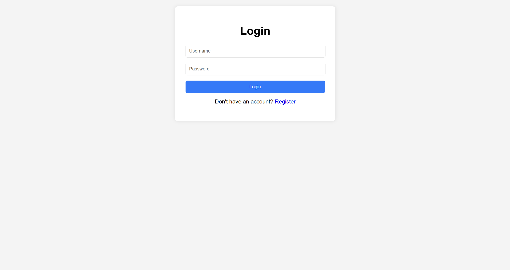
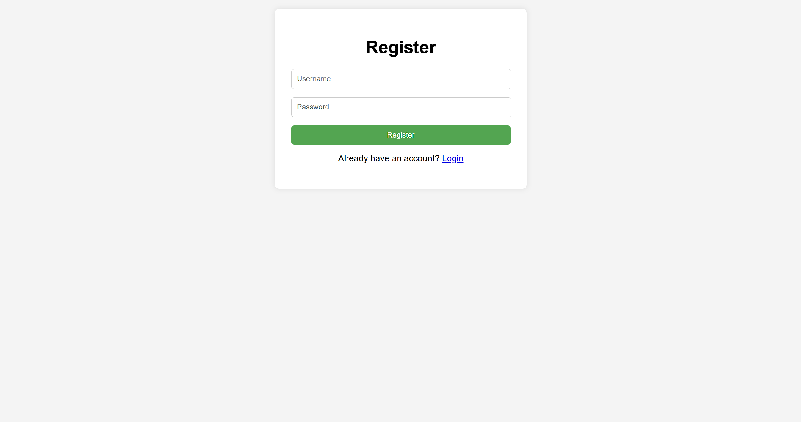
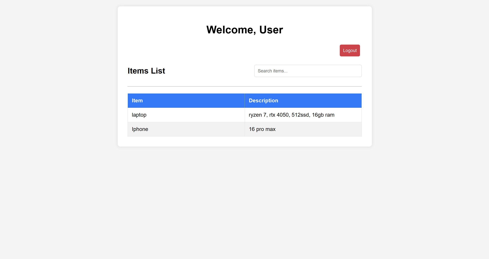
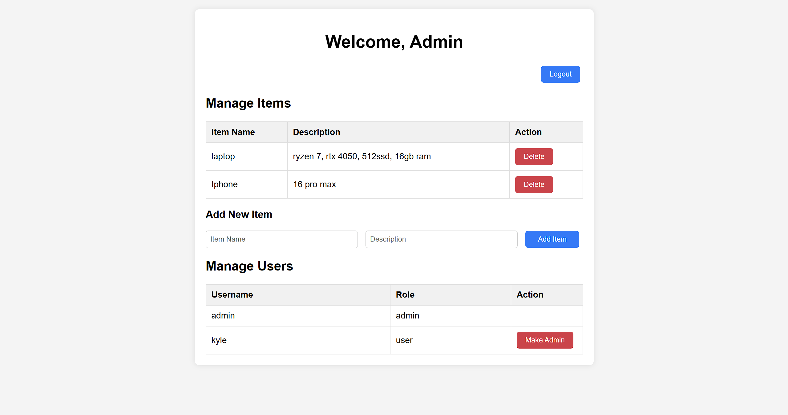

# JWT ASSIGNMENT
---
> ### Install git and node.js if not installed
> Install git -> [git](https://git-scm.com/downloads) <br>
> Install node.js - > [node.js](https://nodejs.org/en)
---


Open CMD and Clone repo
```bash
cd Desktop
git clone https://github.com/genjixxvi/jwt.git
```
Navigate
```bash
cd jwt
```
Install Packages
```bash
npm install
npm install express body-parser jsonwebtoken dotenv cors
```
Start server
```bash
node app.js
```

## > open ``` http://localhost:3000/loginpage.html ```

### login page



### register page



### user page



### admin page

